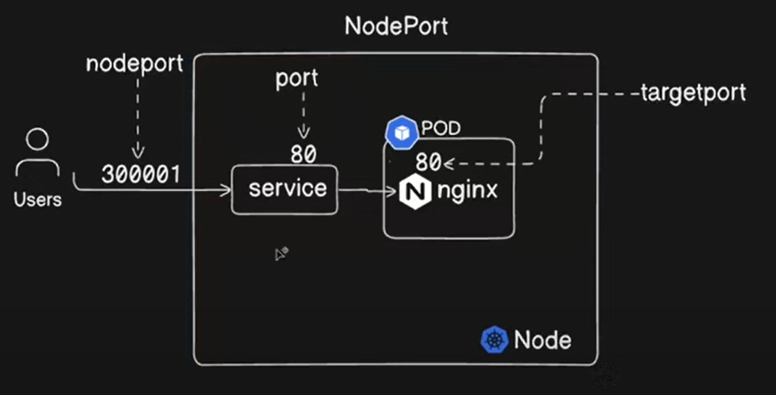
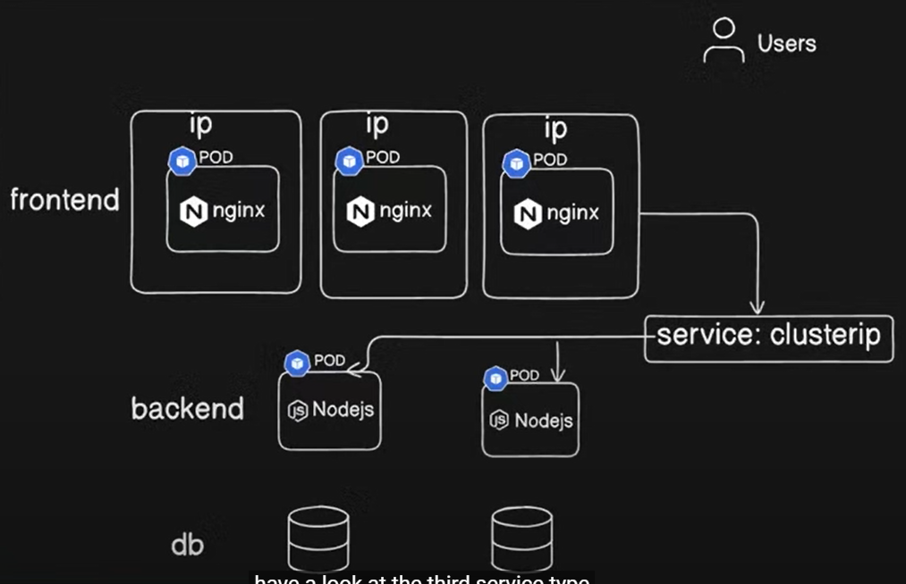
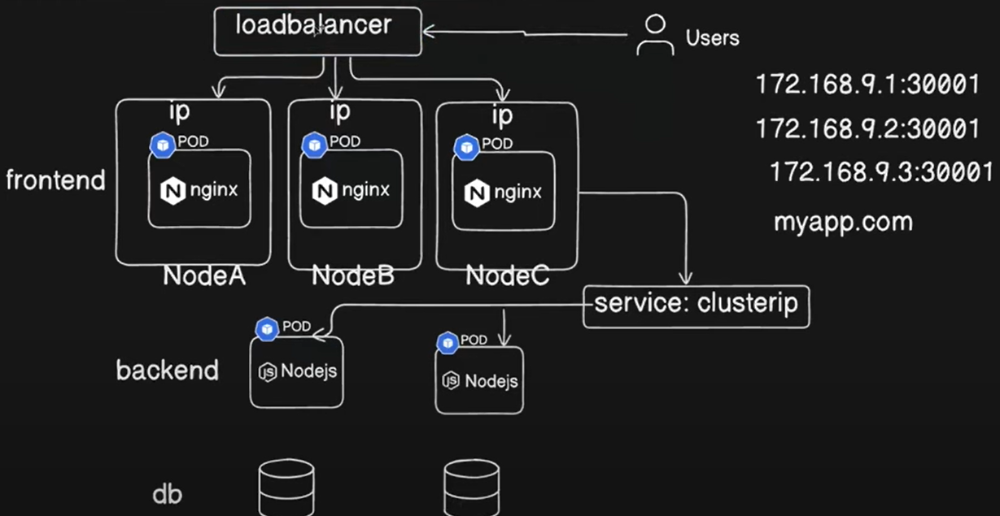

Services:

1. Cluster IP
2. NodePort (30000 - 32767)
3. External names
4. Load balancer

NodePort:

kubectl create -f nodeport.yaml
kubectl get svc
kubectl get pod -o wide
kubectl get nodes -o wide

kubectl expose deployment nginx --port 80 --target-port=8000

Cluster IP:

kubectl get endpoints (ep)

To expose to nodeport through command:
kubectl expose pod <pod name> --port 80 --targetPort 80 --type NodePort

kubectl expose pod jenkins-0 --port 8080 --type NodePort

LoadBalancer:

