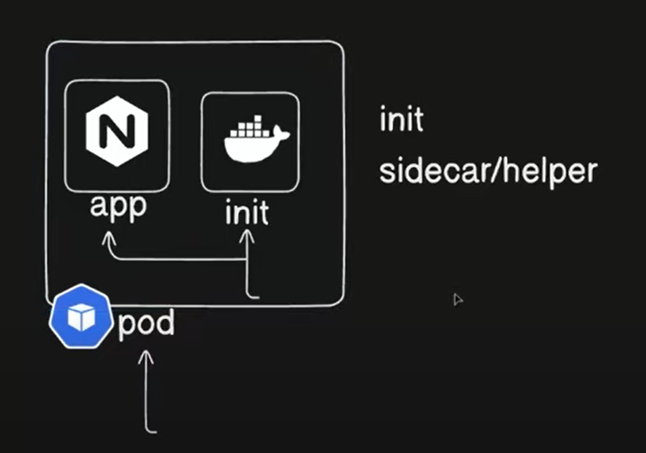

Multi-container:

kubectl logs pod/myapp
kubectl logs pod/myapp -c init-service

kubectl create deploy nginx-deploy --image nginx --port 80

kubectl expose deploy nginx-deploy --name myservice --port 80

kubectl exec -it myapp -- printenv  (to print environment from my container)

kubectl exec -it myapp -- sh