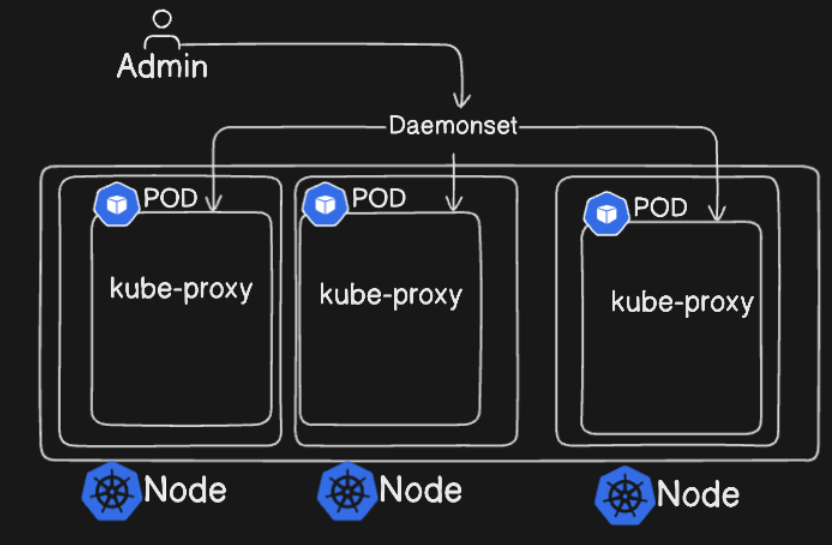
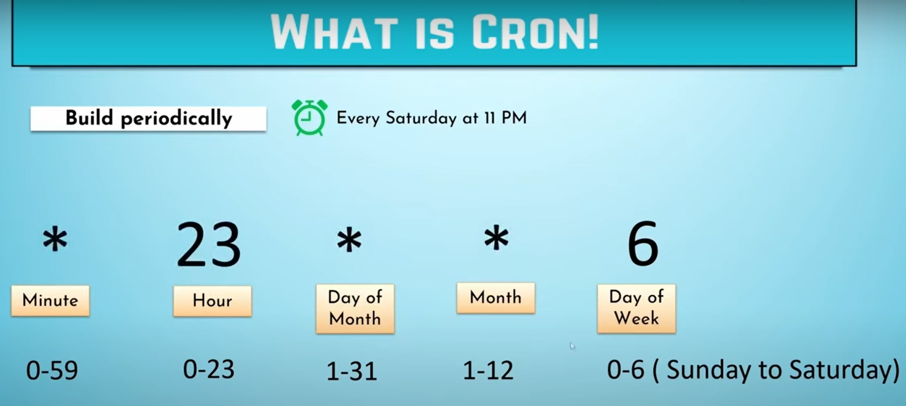
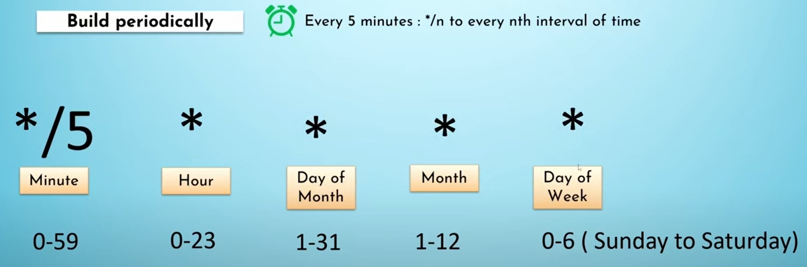

DaemonSet:
A DaemonSet ensures that all (or some) Nodes run a copy of a Pod. As nodes are added to the cluster, Pods are added to them. As nodes are removed from the cluster, those Pods are garbage collected. Deleting a DaemonSet will clean up the Pods it created.

Some typical uses of a DaemonSet are:

running a cluster storage daemon on every node
running a logs collection daemon on every node
running a node monitoring daemon on every node

Usecases of daemonset:
1. For monitoring agent
2. For logging agent
3. kube-proxy will be running on DaemonSet.
4. weave-net for networking CNIs.

Cronjob:

A CronJob creates Jobs on a repeating schedule.

CronJob is meant for performing regular scheduled actions such as backups, report generation, and so on. One CronJob object is like one line of a crontab (cron table) file on a Unix system. It runs a Job periodically on a given schedule, written in Cron format.

Jobs:

A Job creates one or more Pods and will continue to retry execution of the Pods until a specified number of them successfully terminate. As pods successfully complete, the Job tracks the successful completions. When a specified number of successful completions is reached, the task (ie, Job) is complete. Deleting a Job will clean up the Pods it created. Suspending a Job will delete its active Pods until the Job is resumed again.
