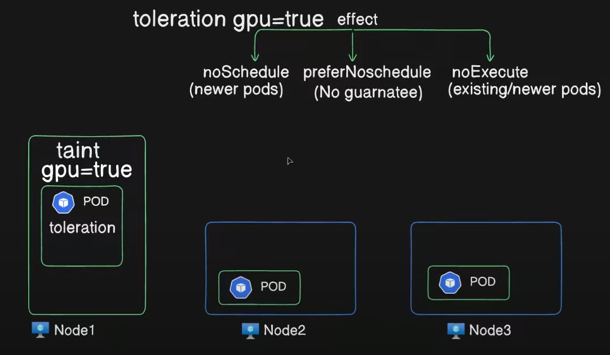

Taints and Tolerations in k8s:

Node affinity is a property of Pods that attracts them to a set of nodes (either as a preference or a hard requirement). Taints are the opposite -- they allow a node to repel a set of pods.

Tolerations are applied to pods. Tolerations allow the scheduler to schedule pods with matching taints. Tolerations allow scheduling but don't guarantee scheduling: the scheduler also evaluates other parameters as part of its function.

Taints and tolerations work together to ensure that pods are not scheduled onto inappropriate nodes. One or more taints are applied to a node; this marks that the node should not accept any pods that do not tolerate the taints.

Difference between Taint, tolerations and nodeselector:

Taint and toleration: It works as a restrictions applied on the node. so node makes the decision what type of pods to accept.
Nodeselector: In this, pods will take the decision on which node it wants to go.

kubectl taint node cka-cluster-worker gpu=true:NoSchedule
kubectl taint node <node name> key=value:effect

kubectl describe node cka-cluster-worker |grep -i taint    #To see info of taint on particular node
kubectl describe node <node name> |grep Taints

Ex in pod:
tolerations:
- key: "gpu"
  operator: "Equal"
  value: "true"
  effect: "NoSchedule"

kubectl taint node <node name> gpu=true:NoSchedule-  # To untaint(-) for particular node

kubectl run nginx --image=nginx --dry-run=client -o yaml > nginx.yaml

Assign label to node:
kubectl label node <node name> gpu=false            (For selector with pod)

*Tainted in nodes.
*Toleration in pods.

