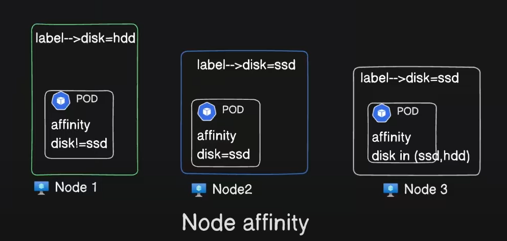
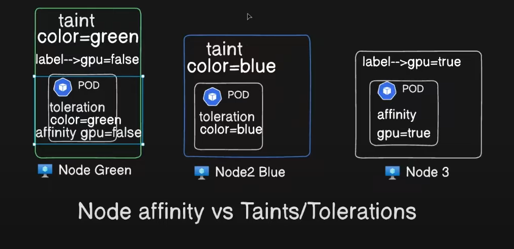

Kubernetes Node Affinity:

Assign pods to nodes using Node Affinity.

requiredDuringSchedulingIgnoredDuringExecution:
   when pod need to assign only those nodes (by using labels).
preferredDuringSchedulingIgnoredDuringExecution:
   when pod is not mandatory to assign only on that nodes. (But first prefer to any node affinity assigned, if not found will assign to any node).

kubectl label node <node-name> disktype=ssd

kubectl label node <node-name> disktype-   (for deleting label)

