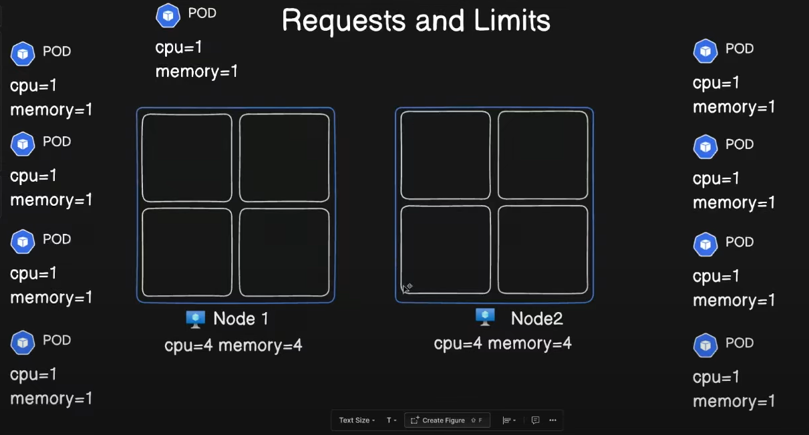
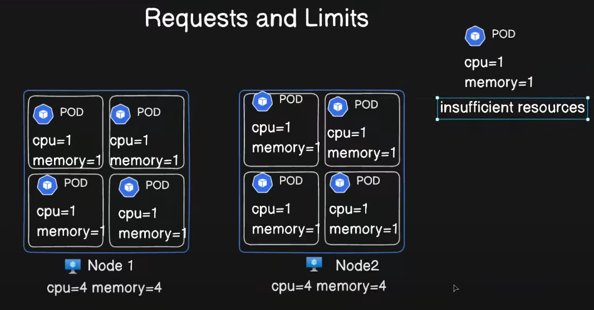
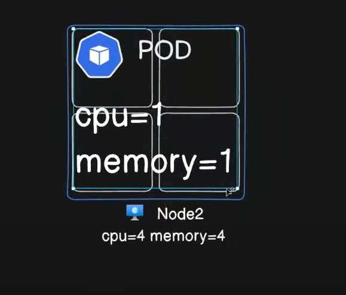

Resources:
When you specify a Pod, you can optionally specify how much of each resource a container needs. The most common resources to specify are CPU and memory (RAM); there are others.

Requests and limits:
If the node where a Pod is running has enough of a resource available, it's possible (and allowed) for a container to use more resource than its request for that resource specifies. However, a container is not allowed to use more than its resource limit.

For example, if you set a memory request of 256 MiB for a container, and that container is in a Pod scheduled to a Node with 8GiB of memory and no other Pods, then the container can try to use more RAM.

kubectl top node

kubectl top pod <pod name> -n <namespace>

OOM - Out Of the Memeory
A pod requesting more memory than is available will be killed due to an OOM (Out of Memory) error.

EX:
Think of your Kubernetes cluster as a bustling city and pods as tenants in an apartment building. Each tenant (pod) requires specific resources like CPU and memory to function:

Requests: This is the minimum amount of resources a pod needs to operate smoothly. Think of it as a guaranteed reservation for the pod.
Limits: This is the maximum amount of resources a pod can use. It acts as a safety cap to prevent any pod from consuming more than its fair share and disrupting others.

Why are Requests & Limits Important?
Resource Control: By setting limits, you prevent a single pod from monopolizing resources, which can lead to issues like out-of-memory (OOM) kills or CPU starvation. ☠️ Why OOM can be a good thing? Because it kills the pod; otherwise, the container would have consumed all the memory and could kill the node. Killing the pod is a better option than killing a node itself.
Predictability: Requests help the scheduler allocate resources efficiently and ensure pods have the necessary resources to run effectively.