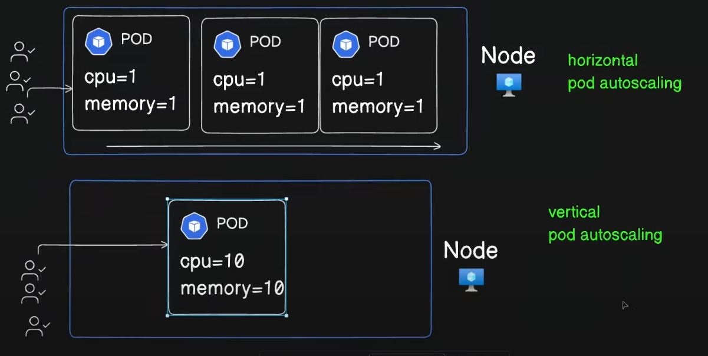
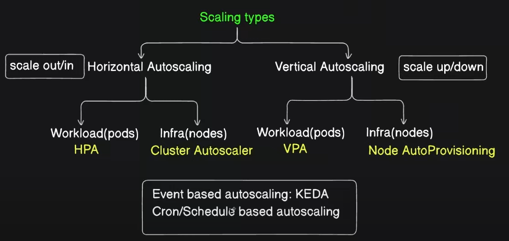
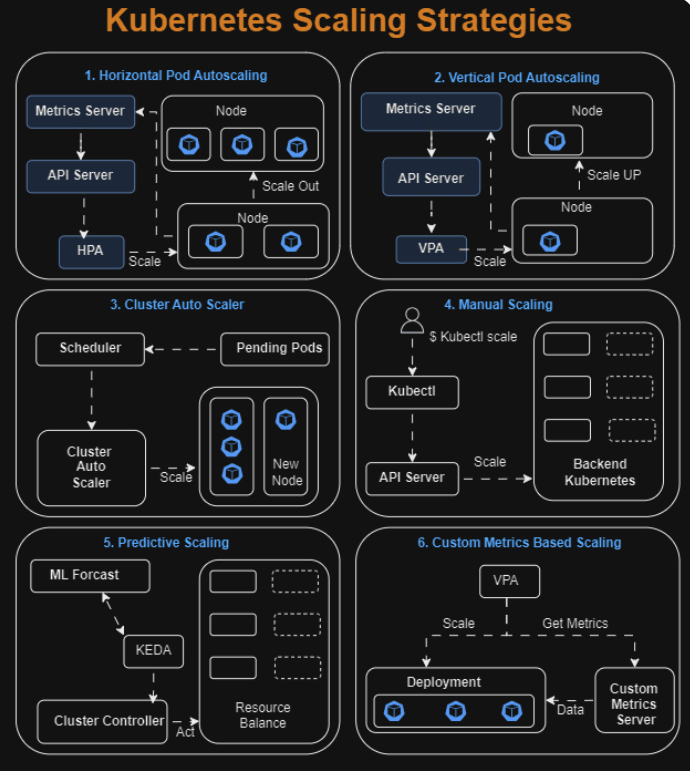

Auto scaling in k8s:

kubectl autoscale deploy php-apache --cpu-percent=50 --min=1 --max=5

Increase the load:
kubectl run -i --tty load-generator --rm --image=busybox:1.28 --restart=Never -- /bin/sh -c "while sleep 0.01; do wget -q -O- http://php-apache; done"

kubectl get hpa php-apache --watch

𝗞𝘂𝗯𝗲𝗿𝗻𝗲𝘁𝗲𝘀 𝗦𝗰𝗮𝗹𝗶𝗻𝗴 𝗦𝘁𝗿𝗮𝘁𝗲𝗴𝗶𝗲𝘀
 
𝐇𝐨𝐫𝐢𝐳𝐨𝐧𝐭𝐚𝐥 𝐒𝐜𝐚𝐥𝐢𝐧𝐠 (𝐒𝐜𝐚𝐥𝐢𝐧𝐠 𝐎𝐮𝐭):- 
Horizontal scaling involves altering the number of pods available to the cluster to suit sudden changes in workload demands. As the scaling technique involves scaling pods instead of resources, it’s commonly a preferred approach to avoid resource deficits.
 
𝐕𝐞𝐫𝐭𝐢𝐜𝐚𝐥 𝐒𝐜𝐚𝐥𝐢𝐧𝐠 (𝐒𝐜𝐚𝐥𝐢𝐧𝐠 𝐔𝐩):-
Contrary to horizontal scaling, a vertical scaling mechanism involves the dynamic provisioning of attributed resources such as RAM or CPU of cluster nodes to match application requirements. This is essentially achieved by tweaking the pod resource request parameters based on workload consumption metrics.
 
𝐂𝐥𝐮𝐬𝐭𝐞𝐫/𝐌𝐮𝐥𝐭𝐢𝐝𝐢𝐦𝐞𝐧𝐬𝐢𝐨𝐧𝐚𝐥 𝐒𝐜𝐚𝐥𝐢𝐧𝐠 :-
Cluster scaling involves increasing or reducing the number of nodes in the cluster based on node utilization metrics and the existence of pending pods. The cluster autoscaling object typically interfaces with the chosen cloud provider so that it can request and deallocate nodes seamlessly as needed.
 
𝐌𝐚𝐧𝐮𝐚𝐥 𝐒𝐜𝐚𝐥𝐢𝐧𝐠 :-
Manual scaling in Kubernetes involves adjusting the number of nodes or resources allocated to a cluster manually. This can be done by adding or removing nodes, adjusting resource requests and limits, and distributing workloads across nodes to optimize performance.
 
𝐏𝐫𝐞𝐝𝐢𝐜𝐭𝐢𝐯𝐞 𝐒𝐜𝐚𝐥𝐢𝐧𝐠 𝐢𝐧 𝐊𝐮𝐛𝐞𝐫𝐧𝐞𝐭𝐞𝐬 :-
Predictive scaling stands as a transformative approach in the orchestration of cloud-native applications, allowing Kubernetes to not just react to current demands but to anticipate future needs. This forward-looking strategy harnesses the power of data analysis and machine learning to create a more dynamic, efficient, and user-oriented scaling process.

