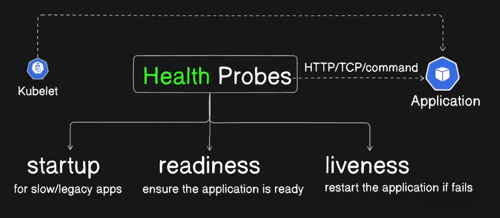

Health probes:

What are probes?
To investigate or monitor something and to take necessary actions

What are health probes in Kubernetes:
Health probes monitor your Kubernetes applications and take necessary actions to recover from failure.
To ensure your application is highly available and self-healing

Type of health probes in Kubernetes:
Readiness ( Ensure application is ready)
Liveness ( Restart the application if health checks fail)
Startup ( Probes for legacy applications that need a lot of time to start)

Types of health checks they perform:
HTTP/TCP/command

