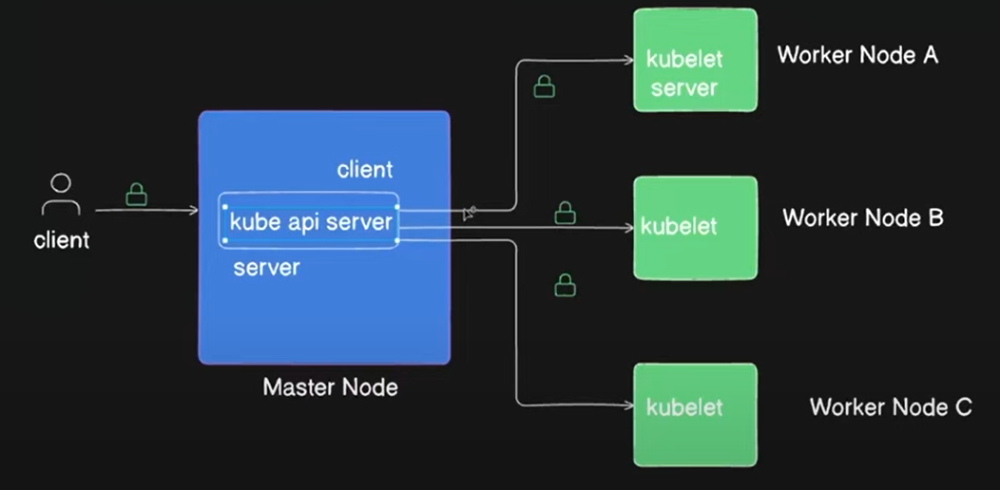
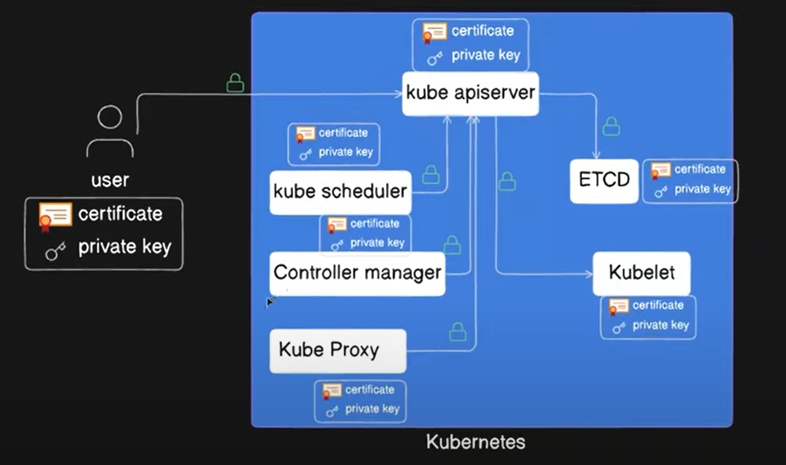
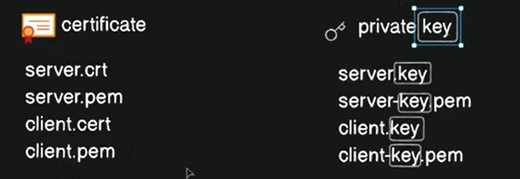
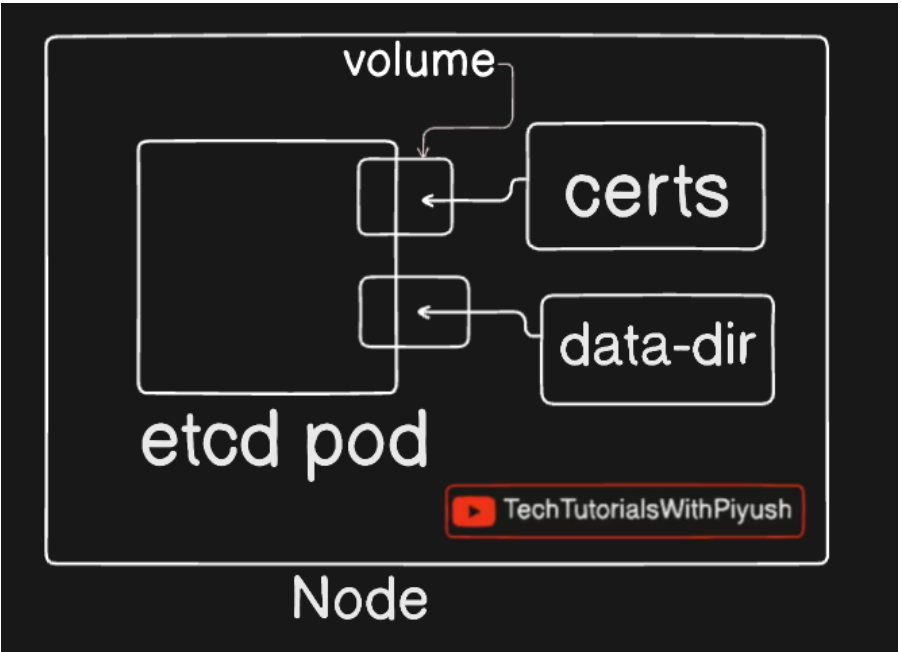

Types of certificates:

1. Client certificate
2. server certificate
3. Root certificate (certificate authority).

How certs are loaded:

kubectl get csr

To generate a key file:
openssl genrsa -out adam.key 2048

To generate a csr file:
openssl req -new -key adam.key -out adam.csr -subj "/CN=adam"

To decode csr:
cat adam.csr | base64 | tr -d "/n"

To approve a csr:
kubectl certificate approve <certificate-signing-request-name>

To deny a csr:
kubectl certificate deny <certificate-signing-request-name>

Below document can also be referred

https://kubernetes.io/docs/reference/access-authn-authz/certificate-signing-requests
#create-certificatessigningrequest