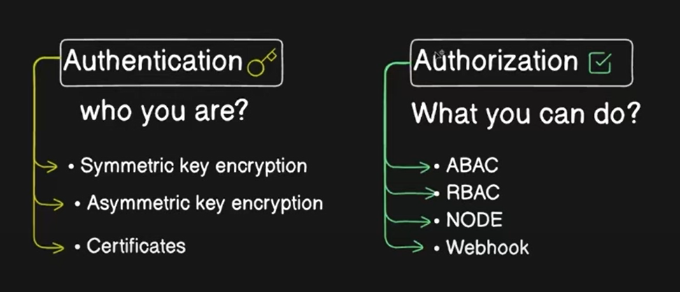

Authentication: Verifying Who You Are
Imagine your cluster is a fortress. Authentication is like checking IDs at the gate. Kubeconfig is your keycard containing certificates that identify you to the Kubernetes API server.

Making API Calls:
To run a command against a cluster, you can use the below command

kubectl get pods --kubeconfig config

Normally, kubectl uses your local $HOME/.kube/config file for authentication so you dont have to pass the --kubeconfig parameter in every command. You can use below command

kubectl get pods

The below command shows an API call using raw arguments:

kubectl get --raw /api/v1/namespaces/default/pods \
  --server https://localhost:64418 \
  --client-key adam.key \
  --client-certificate adam.crt \
  --certificate-authority ca.crt

Authorization: What You Can Do
Authorization is like granting access levels within the fortress. Kubernetes offers different methods:

Node Authorizer: Ensures kubelets on nodes are authorized to communicate with the API server.
ABAC (Attribute-Based Access Control): Associates users with permissions but can be complex to manage.
RBAC (Role-Based Access Control): The recommended approach! You create roles (like "dev") and assign users or groups to those roles.
Webhooks (Optional): Leverage external tools like OPA for more complex authorization logic.

Authorization Modes:
The API server can be configured with different authorization modes (like "always allow" or "always deny"), but these are for testing only. In practice, a priority sequence is used as below:-

Node Authorizer: Checks node communication.
RBAC: Grants access based on assigned roles.
Webhook (if enabled): Performs additional authorization checks.

Remember:
Authentication verifies your identity.
Authorization determines your access level.
RBAC is a user-friendly and recommended way to manage authorization.
Keep exploring, Kubernetes ninjas! There's more to discover in the video about configuring authentication and authorization in your cluster.