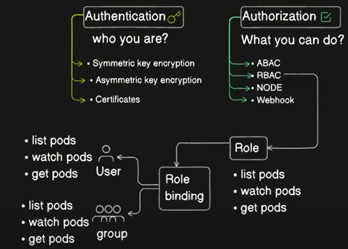

#### RBAC:

kubectl autho can-i get pod
kubectl auth whoami
kubectl auth can-i get pod --as <username>

kubectl get roles -A
kubectl get roles -A --no-headers | wc -l (count the no.of roles by lines)

**Generate the csr key and file**

```bash
openssl genrsa -out krishna.key 2048
openssl req -new -key adam.key -out krishna.csr -subj "/CN=krishna"
```

#### to check who you are
`kubectl auth whoami`

#### to check if you have access to a particular resource
```
k auth can-i create po
k auth can-i create po --as krishna
```
#### To get the crt file in decoded format
```
kubectl get csr krishna -o jsonpath='{.status.certificate}'| base64 -d > krishna.crt
```

### Sample YAML for role

```yaml
apiVersion: rbac.authorization.k8s.io/v1
kind: Role
metadata:
  namespace: default
  name: pod-reader
rules:
- apiGroups: [""] # "" indicates the core API group
  resources: ["pods"]
  verbs: ["get", "watch", "list"]
```

### Sample YAML for role binding

```yaml
apiVersion: rbac.authorization.k8s.io/v1
# This role binding allows "jane" to read pods in the "default" namespace.
# You need to already have a Role named "pod-reader" in that namespace.
kind: RoleBinding
metadata:
  name: read-pods
  namespace: default
subjects:
# You can specify more than one "subject"
- kind: User
  name: krishna # "name" is case sensitive
  apiGroup: rbac.authorization.k8s.io
roleRef:
  # "roleRef" specifies the binding to a Role / ClusterRole
  kind: Role #this must be Role or ClusterRole
  name: pod-reader # this must match the name of the Role or ClusterRole you wish to bind to
  apiGroup: rbac.authorization.k8s.io
```


https://kubernetes.io/docs/reference/access-authn-authz/certificate-signing-requests/
