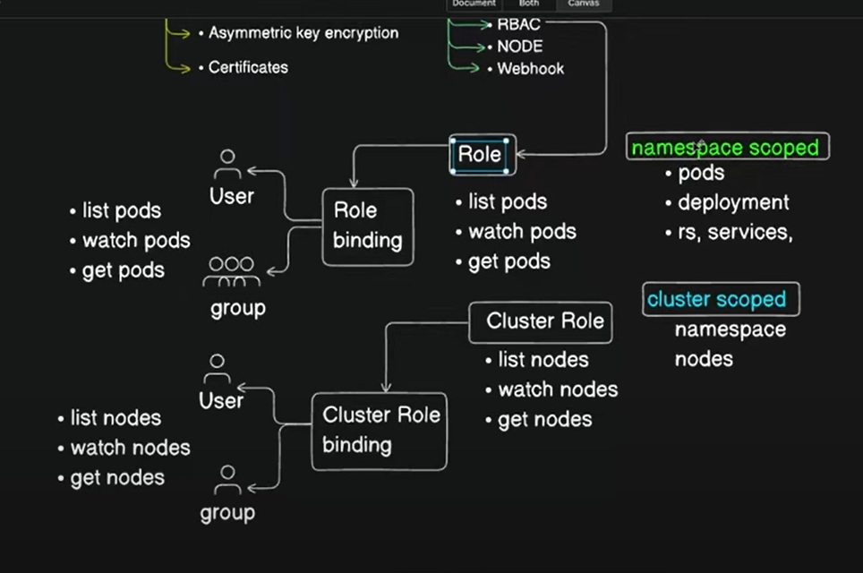

### To list object of namespace level
`kubectl api-resources --namespaced=true`

### To list object of cluster level
`kubectl api-resources --namespaced=false`

kubectl auth can-i get nodes --as krishna

### Create Clusterrole
kubectl create clusterrole node-reader --verb=get,list,watch --resource=node
kubectl get clusterrole
kubectl describe clusterrole/node-reader

### Create clusterrole binding
kubectl create clusterrolebinding reader-binding --clusterrole=node-reader --user=krishna
kubectl get clusterrolebinding
kubectl describe clusterrolebinding/reader-binding


**Roles & Role Bindings: Granting Permissions** 

Think of roles as job descriptions defining user or group actions. Role bindings link these roles to specific users or groups, granting them those permissions. 

* **Roles:** Define permissions within a namespace. 
   * Example: A "developer" role might allow getting, viewing, and deleting pods, as well as creating and viewing secrets. 
* **Role Bindings:** Connect roles to users or groups. 

**Cluster Roles: Expanding Permissions Beyond Namespaces**

Cluster roles are like superpowered roles that can access resources across all namespaces. This includes powerful stuff like managing nodes, persistent volumes (PVs), certificate signing requests (CSRs), and even namespaces. 

* **Check Available Resources:** Use `kubectl api-resources namespaced=false` to see cluster-scoped resources. Replace `false` with `true` to check the namespace-scoped resources.

**Cluster Role Bindings: Linking Users to Cluster Roles**

Like role bindings, cluster role bindings connect users or groups to cluster roles, granting cluster-wide permissions. 

### Commands to create cluster role and cluster role binding

https://kubernetes.io/docs/reference/access-authn-authz/rbac/

```
kubectl create clusterrole node-reader --verb=get,list,watch --resource=nodes
```

```
kubectl create clusterrolebinding node-reader-binding --clusterrole=node-reader --user=adam
```

**Key Points:**

* Roles are namespace-scoped, while cluster roles are cluster-wide. 
* Use role bindings and cluster role bindings to assign permissions to users or groups. 
* Carefully manage permissions to ensure security and prevent unauthorized access. 

