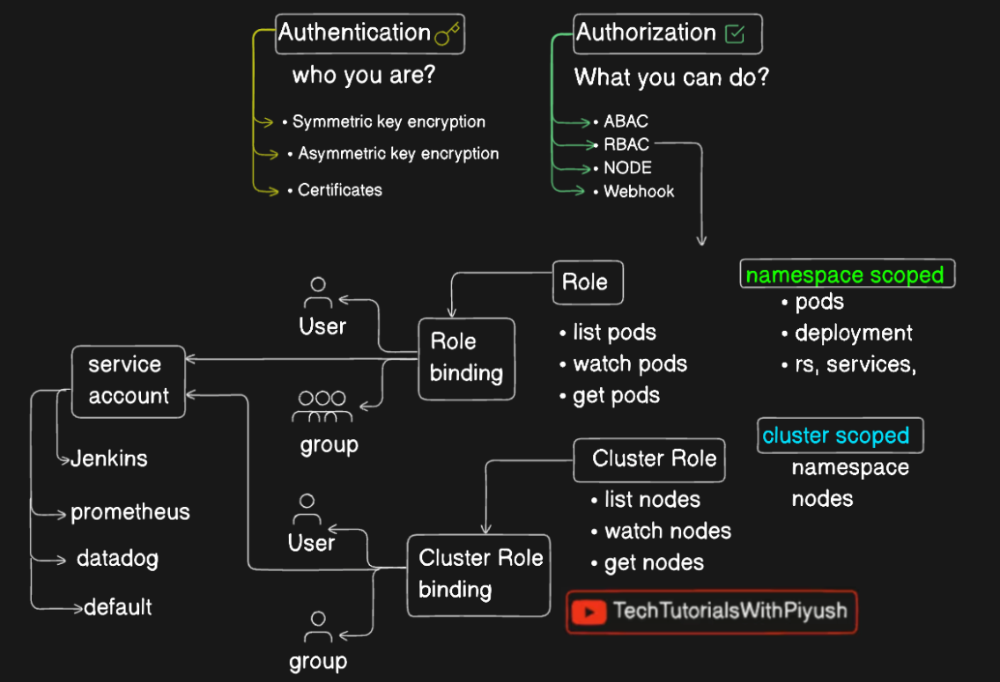

### Service Account:



## Create service account

```
kubectl create sa build-sa
kubectl describe sa build-sa
```

#### What is a service account in Kubernetes

There are multiple types of accounts in Kubernetes that interact with the cluster. These could be user accounts used by Kubernetes Admins, developers, operators, etc., and service accounts primarily used by other applications/bots or Kubernetes components to interact with other services.

- To create a service account 
```
kubectl create sa name
kubectl get sa
```

- Then you can add role and role binding to grant access

>Note: Kubernetes also create 1 default service account in each of the default namespace such as kube-sytem, kube-node-lease and so on

