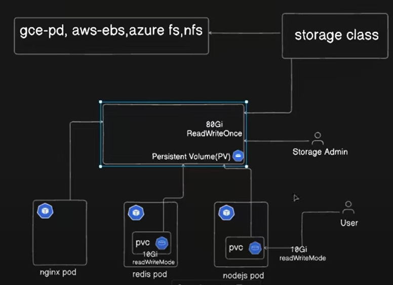

### Kubernetes Volume Simplified | Persistent Volume, Persistent Volume Claim & Storage Class



### Example snippet of non-persistent volume , type:emptydir

```yaml
volumeMounts:
    - name: redis-storage
      mountPath: /data/redis
  volumes:
  - name: redis-storage
    emptyDir: {}
```

### Sample pv used in the demo

```
apiVersion: v1
kind: PersistentVolume
metadata:
  name: task-pv-volume
  labels:
    type: local
spec:
  storageClassName: standard
  capacity:
    storage: 1Gi
  accessModes:
    - ReadWriteOnce
  hostPath:
    path: "/home/ubuntu/day28-storage-k8s"
```

### Sample PVC used in the demo

```
apiVersion: v1
kind: PersistentVolumeClaim
metadata:
  name: task-pv-claim
spec:
  storageClassName: standard
  accessModes:
    - ReadWriteOnce
  resources:
    requests:
      storage: 500Mi
```

### Sample pod yaml used in the demo

```yaml
apiVersion: v1
kind: Pod
metadata:
  name: task-pv-pod
spec:
  volumes:
    - name: task-pv-storage
      persistentVolumeClaim:
        claimName: task-pv-claim
  containers:
    - name: task-pv-container
      image: nginx
      ports:
        - containerPort: 80
          name: "http-server"
      volumeMounts:
        - mountPath: "/usr/share/nginx/html"
          name: task-pv-storage
```


